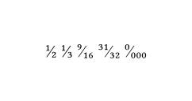

# The `frackable` Package
<div align="center">Version 0.1.1</div>

Provides a function, `frackable(numerator, denominator, whole: none)`, to typeset vulgar and mixed fractions. Provides a second `generator(font-size: 0.5em, shift-numerator: -0.3em, shift-denominator: 0.05em)` function that returns another having the same signature as `frackable` to typeset arbitrary vulgar and mixed fractions in fonts that do not support the `frac` feature.

```typ
#import "@preview/frackable:0.1.1": *

#frackable(1, 2)
#frackable(1, 3)
#frackable(3, 4, whole: 9)
#frackable(9, 16)
#frackable(31, 32)
#frackable(0, "000")

```


